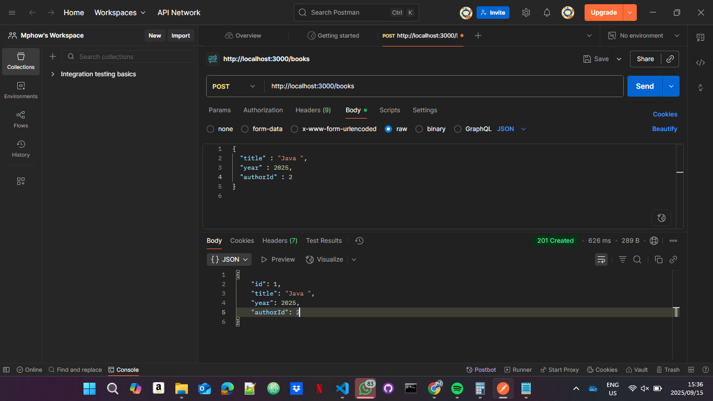
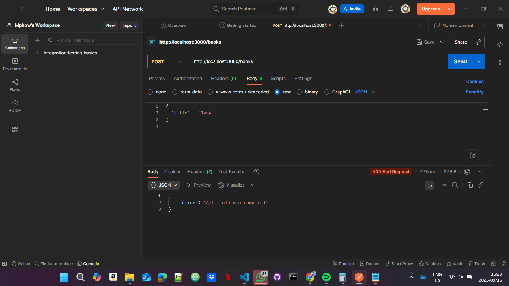
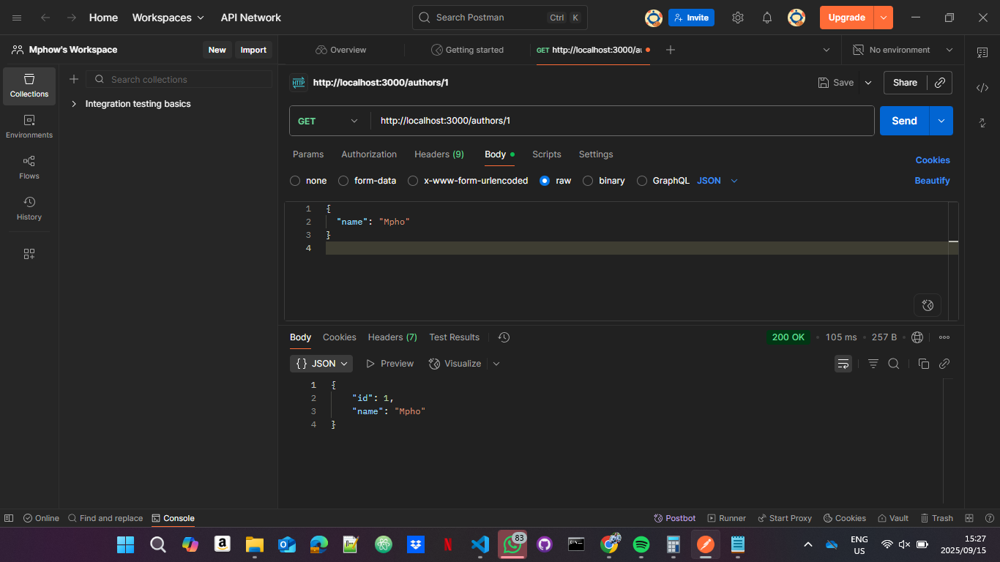
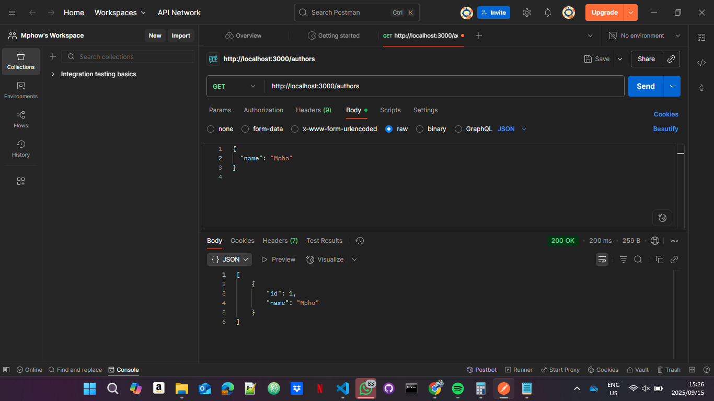
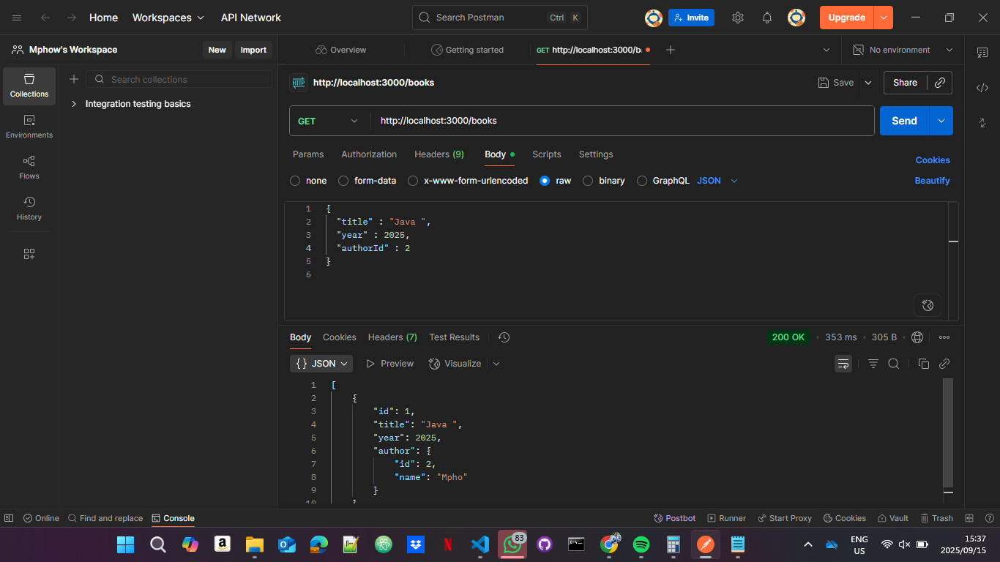

# Library API
A modular RESTful API for managing books, authors, and borrowers—built with Express and TypeScript. Designed for clarity, reliability, and hands-on testing with Postman.
# Screenshorts 









# Features
- Add, update, delete, and fetch books with linked author info
- Manage authors with full CRUD support
- Register borrowers and prepare for borrowing logic
- Centralized error handling with clean status codes (400, 404, 409)
- Modular architecture with clear separation of models, data, and routes
- Visual testing supported via Postman

# Project Setup Intruction
## Clone the repository
    ```bash
        git clone https://github.com/khaphathe/express-library-api.git
        cd library-api
    ```
## 2. Open the project in VS Code 
```bash
    code . 
```
## 3. Switch to dev branch 
```bash
    git checkout dev
```

## 4. Install dependencies

    npm install

## 5. How to run 

    npm run dev

# API Endpoints

## Books
POST /books – Add a new book

GET /books – List all books with author info

GET /books/:id – Get a book by ID

PUT /books/:id – Update a book

DELETE /books/:id – Delete a book


## Authors
  
POST /authors – Add a new author

GET /authors – List all authors

GET /authors/:id – Get an author by ID

PUT /authors/:id – Update an author

DELETE /authors/:id – Delete an author

# Testing with Postman
All endpoints return clean JSON responses with appropriate status codes. Use Postman to visually test each route and confirm behavior step-by-step.


## Acknowledgements

Special thanks to all contributors, testers, and viewers who help improve this project.